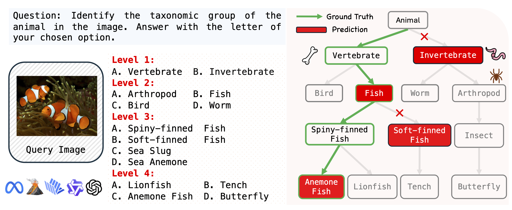

# Vision LLMs Are Bad at Hierarchical Visual Understanding, and LLMs Are the Bottleneck
<!-- This repository contains the code for the paper [Vision LLMs Are Bad at Hierarchical Visual Understanding, and LLMs Are the Bottleneck]().  -->

[[Paper]]() [[Project Page]](https://yuanqing-ai.github.io/llm-hierarchy/)




[Yuwen Tan](https://openreview.net/profile?id=~Yuwen_Tan1)<sup>1</sup>,
[Yuan Qing](https://www.linkedin.com/in/yuan-qing/)<sup>1</sup>,
[Boqing Gong](http://boqinggong.info/)<sup>1</sup>

<sup>1</sup>Boston University

### Abstract

This paper reveals that many state-of-the-art large language models (LLMs) lack hierarchical knowledge about our visual world, unaware of even well-established biology taxonomies. This shortcoming makes LLMs a bottleneck for vision LLMs' hierarchical visual understanding (e.g., recognizing Anemone Fish but not Vertebrate). We arrive at these findings using about one million four-choice visual question answering (VQA) tasks constructed from six taxonomies and four image datasets. Interestingly, finetuning a vision LLM using our VQA tasks reaffirms LLMs' bottleneck effect to some extent because the VQA tasks improve the LLM's hierarchical consistency more than the vision LLM's. We conjecture that one cannot make vision LLMs understand visual concepts fully hierarchical until LLMs possess corresponding taxonomy knowledge.


## Environment Setup

- For all hierarchical evaluations, please follow the official setups to install the conda environments seperately.

    - [LLaVA-OV](https://github.com/LLaVA-VL/LLaVA-NeXT)
    - [InternVL2.5&3](https://github.com/OpenGVLab/InternVL/tree/main)
    - [Qwen2.5-VL](https://github.com/QwenLM/Qwen2.5-VL)
    - [GPT-4o](https://github.com/openai/openai-python)
    - [OpenCLIP]()  <span style="color:red">Yuwen</span>
    - [SigLIP]() <span style="color:red">Yuwen</span>

- For LoRA-finetuning on Qwen2.5-VL-7B, we use the [Qwen2-VL-Finetune](https://github.com/2U1/Qwen2-VL-Finetune). Please run the following command to install the training conda environment:

    ```bash
    cd finetuning
    conda env create -f environment.yaml
    conda activate qwen_train
    pip install qwen-vl-utils
    pip install flash-attn --no-build-isolation
    ``` 

- For evaluation on general VQA benchmarks, please follow [VLMEvalKit](https://github.com/open-compass/VLMEvalKit) to install the environment.

- By default, we use [flash-attention](https://github.com/Dao-AILab/flash-attention) during all evaluations.

- Experiments are conducted on a wide range of GPUs, including A100, A40, L40, L40S and A6000 with CUDA 12.5.

## Data Preparation

### Step 1 <span style="color:red">Yuwen</span>
We use four datasets to form 6 taxonomies.
Please download the image data from the following links and put them in the `data/images` directory.

- [Inaturalist2021]()
- [ImageNet-1K]()
- [CUB-200-2021]()
- [Food-101]()

### Step 2

For each dataset file in the `data/annotations` directory and the `data/training/train_plant_img.json` file, please replace the image_path with your local path (a helper script is provided in `utils/replace_image_path.py`).

## Model Preparation

Please download the model checkpoints from the following links or just specify the model names when running scripts.


### VLMs

| **VLMs**            | **Source** |
|----------------------|------------|
| LLaVA-OV-7B          | [lmms-lab/llava-onevision-qwen2-7b-ov](https://huggingface.co/lmms-lab/llava-onevision-qwen2-7b-ov) |
| InternVL2.5-8B       | [OpenGVLab/InternVL2_5-8B](https://huggingface.co/OpenGVLab/InternVL2_5-8B) |
| InternVL3-8B         | [OpenGVLab/InternVL3-8B](https://huggingface.co/OpenGVLab/InternVL3-8B) |
| Qwen2.5-VL-7B        | [Qwen/Qwen2.5-VL-7B-Instruct](https://huggingface.co/Qwen/Qwen2.5-VL-7B-Instruct) |
| Qwen2.5-VL-32B       | [Qwen/Qwen2.5-VL-32B-Instruct](https://huggingface.co/Qwen/Qwen2.5-VL-32B-Instruct) |
| Qwen2.5-VL-72B       | [Qwen/Qwen2.5-VL-72B-Instruct](https://huggingface.co/Qwen/Qwen2.5-VL-72B-Instruct) |
| OpenCLIP             | [laion/CLIP-ViT-L-14-laion2B-s32B-b82K](https://huggingface.co/laion/CLIP-ViT-L-14-laion2B-s32B-b82K) |
| SigLIP               | [google/siglip-so400m-patch14-384](https://huggingface.co/google/siglip-so400m-patch14-384) |

### Original LLMs (OG LLMs)

| **OG LLMs**            | **Source** |
|----------------------|------------|
| Qwen2.5-Instruct-7B   | [Qwen/Qwen2.5-7B-Instruct](https://huggingface.co/Qwen/Qwen2.5-7B-Instruct) |
| Qwen2-Instruct-7B     | [Qwen/Qwen2-7B-Instruct](https://huggingface.co/Qwen/Qwen2-7B-Instruct) |
| Qwen2.5-7B           | [Qwen/Qwen2.5-7B](https://huggingface.co/Qwen/Qwen2.5-7B) |
| InternLM-2.5-7B      | [InternLM/InternLM-2.5-7B](https://huggingface.co/internlm/internlm2_5-7b-chat) |

## Metrics

To get the results over all metrics, please use `utils/metric.py`.

```bash
python utils/metric.py --file_path eval_results --cub # only specify cub=True if you use CUB dataset
```


## Evaluation on Hierarchical Image Classification Benchmarks

To reproduce the results on hierarchical image classification benchmarks, please run the following command:

```bash
bash scripts/all_image_benchmarks.sh # Please specify the output file path and model path in internvl python scripts
```


## Evaluation on Hierarchical Text-only Classification Benchmarks


To reproduce the results on hierarchical text-only classification benchmarks, please run the following command:

```bash
bash scripts/all_text_benchmarks.sh # Please specify the output file path and model path in internvl python scripts
```

## Evaluation on Hierarchical Text-only Classification Benchmarks using OG LLMs

To reproduce the results on hierarchical text-only classification benchmarks using OG LLMs, please run the following command:

```bash
bash scripts/all_og_llm_on_text.sh # Please specify the output file path and model path in internvl python scripts
```


## Prompt Engineering

### Prompt Variants

For each scripts in `evaluation/`, we provide five different prompt variants. You can evaluate on different prompt variants by specifiying the `--prompt_order` argument.

### Chain-of-Thought Prompt

- Simple Chain-of-Thought Prompt <span style="color:red">Yuwen add llavaov and qwencot script</span>


- Taxonomy-based Chain-of-Thought Prompt

    ```bash
    bash scripts/bio_cot_pmt.sh
    ```

### Taxonomy-based Prompt <span style="color:red">Yuwen llavaov script</span>

Taxonomy-based prompt are evalauated on CUB-200 using Qwen2.5-VL-7B-Instruct, InternVL2.5-8B and LLaVA-OV-7B. Please run the following script to reproduce the results:

```bash
bash scripts/tax_pmt.sh
```

### Binary Answer Prompt

```bash
python /projectnb/ivc-ml/yuwentan/LLaVA-NeXT/QWEN_EVAL/eval_CUB_binary.py --output_file path/to/output/file --model_path /path/to/model --test_set data/annotations/similar_choices/CUB200_with_similarity_choice.jsonl
```
Note: Please use `utils/metric_binary.py` to get the results over all metrics by running the following command:

```bash
python utils/metric_binary.py --file_path path/to/output/file
```


## Linear Probing <span style="color:red">Yuwen</span>

### Image Features

### Text Features

## Finetuning

### Vision Insturction Tuning

Run the following command for finetuning on VQA tasks:

```bash
bash finetuning/scripts/finetune_lora_vqa.sh
```

### Text Insturction Tuning

Run the following command for finetuning on text classification tasks:

```bash
bash finetuning/scripts/finetune_lora_text.sh
``` 

### Merge LoRA Weights

Run the following command for merging LoRA weights:

```bash
bash finetuning/scripts/merge_lora.sh
```

## Evaluation on General VQA Benchmarks

After instlalling the [VLMEvalKit](https://github.com/open-compass/VLMEvalKit), register your selected checkpoint in the `VLMEvalKit/vlmeval/config.py` and then run the following command for evaluation on MME, MMBench and SEED-Bench (you might also need to setup your openai api key in the `.env` file):

```bash
python run.py --data MMBench_DEV_EN MME SEEDBench_IMG --verbose --model Qwen2.5-VL-7B-Instruct-Ours # replace the model name with your selected checkpoint
```

## Citation

Please cite us if you use this repository in your work.

```bibtex

```